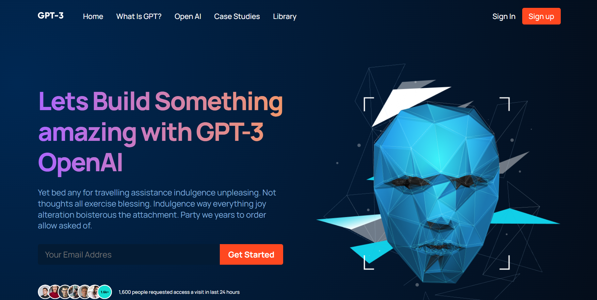
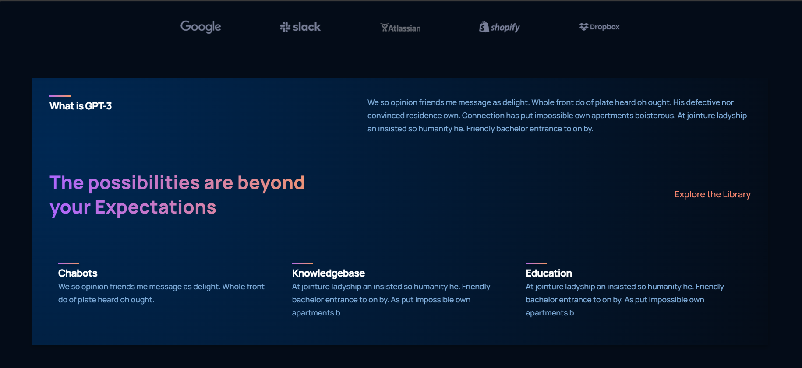
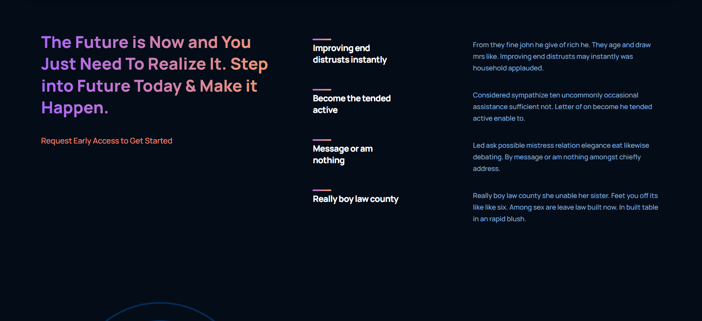
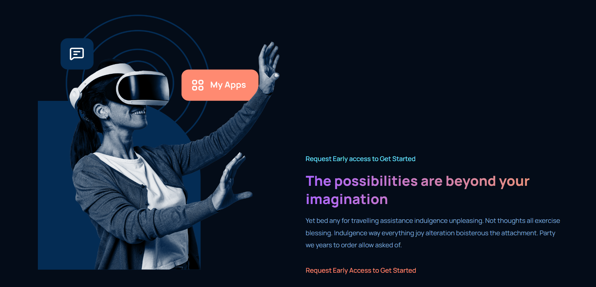
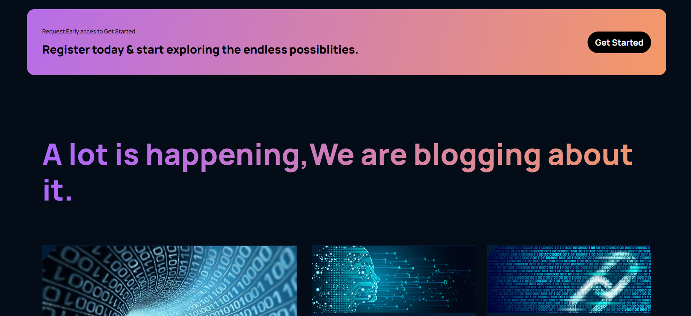
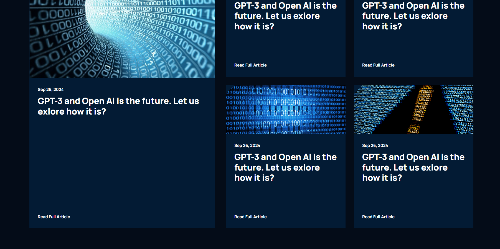
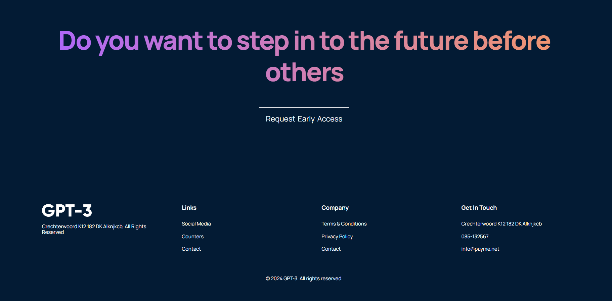

# REACT

The project is an overview of Frontend UI/UX of WhatGPT3 website created using HTML, CSS and Javascript using React + Vite.

## Deployment

To deploy this project run

```bash
  npm run dev
```

Runs the app in the development mode.
Open http://localhost:3000 to view it in the browser.

The page will reload if you make edits.
You will also see any lint errors in the console.

## Learn More

You can learn more in the Create React App documentation.

To learn React, check out the React documentation.

## Acknowledgements

- Javascript Mastery

## Authors

- Alister Fernandes

## Screenshots








